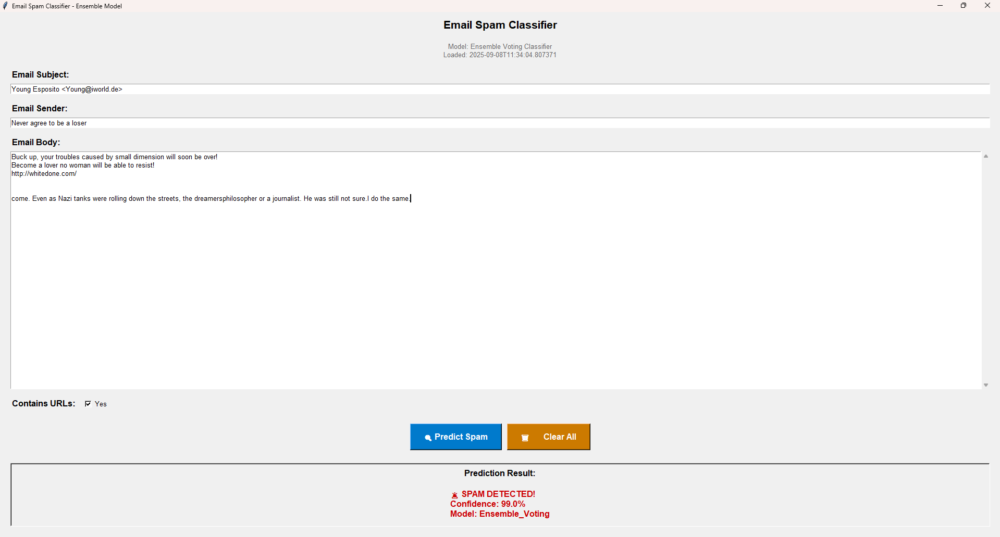

# Email Spam Classifier

A machine learning project for detecting phishing and spam emails using ensemble methods and natural language processing techniques.

## 🎯 Project Overview

This project implements an advanced email spam classification system that can accurately identify phishing and spam emails. The system trains and evaluates multiple machine learning models including Naive Bayes, Logistic Regression, Random Forest, XGBoost, and others, then combines the best-performing models into an **Ensemble Voting Classifier** for optimal accuracy.

### Key Features
- **Multi-model comparison**: Trains 12+ different classification algorithms
- **Ensemble learning**: Combines top-performing models for superior accuracy
- **Text preprocessing**: Advanced NLP techniques including stemming and lemmatization
- **Batch processing**: Efficiently process large datasets
- **Interactive prediction**: Single email classification with confidence scores
- **Comprehensive evaluation**: Detailed performance metrics and visualizations

## 📊 Dataset

**Source**: [Kaggle Phishing Email Dataset](https://www.kaggle.com/datasets/naserabdullahalam/phishing-email-dataset)

### Dataset Structure
The dataset contains the following key columns:
- `sender`: Email sender address
- `receiver`: Email receiver address  
- `date`: Email timestamp
- `subject`: Email subject line
- `body`: Email content/body text
- `urls`: Binary flag indicating presence of URLs
- `label`: Target variable (Spam vs Not Spam)

### Labels
- **Spam**: Phishing/malicious emails
- **Not Spam**: Legitimate emails (ham)

## 🗂️ Project Structure

```
email_spam_classifier/
├── data/                         # Dataset files (not included in repo)
│   └── CEAS_08.csv              # Main dataset
├── models/                       # Trained models and preprocessing components
│   ├── ensemble_voting.pkl      # Final ensemble model
│   ├── tfidf_vectorizer.pkl     # Text vectorizer
│   ├── label_encoder.pkl        # Label encoder
│   ├── tokenizer.pkl            # Text tokenizer
│   └── model_metadata.pkl       # Model metadata and scores
├── spam_classifier.py            # Main training and evaluation script
├── GUI_app.py                   # Desktop GUI application
├── requirements.txt              # Python dependencies
├── model_comparison.png          # Performance comparison visualization
└── README.md                     # Project documentation
```

## 🛠️ Installation & Requirements

### Python version
- Python 3.10.18
  
### Setup Instructions

1. **Clone the repository**
```bash
git clone https://github.com/Ashish1455/Spam-Email-Classification
cd email_spam_classifier
```

2. **Install dependencies**
```bash
pip install -r requirements.txt
```

### Required Dependencies
- **Core Data Science**: pandas, numpy, scipy
- **Machine Learning**: scikit-learn, xgboost
- **Natural Language Processing**: nltk
- **Visualization**: matplotlib, seaborn
- **Model Persistence**: joblib

## 🚀 Usage

### 1. Training the Models

Run the main training script to train all models and create the ensemble:

```bash
python spam_classifier.py
```

This will:
- Load and preprocess the dataset
- Train 12+ different classification models
- Evaluate model performance
- Create an ensemble voting classifier
- Save all models and preprocessing components
- Generate performance visualization plots

### 2. Run Desktop GUI application

Use the interactive prediction script:

```bash
python GUI_app.py
```


## 📈 Model Performance

The project evaluates multiple machine learning algorithms and combines the best performers into an ensemble model.

### Trained Models
- **Naive Bayes variants**: MultinomialNB, GaussianNB, BernoulliNB
- **Linear Models**: Logistic Regression
- **Tree-based Models**: Random Forest, Decision Tree, Extra Trees
- **Boosting Methods**: AdaBoost, Gradient Boosting, XGBoost
- **Other Algorithms**: K-Nearest Neighbors, Bagging Classifier
- **Final Model**: Ensemble Voting Classifier

### Performance Metrics


The ensemble model achieves exceptional performance across all metrics:
- **Accuracy**: >99%
- **Precision**: >99% 

### Model Selection Criteria
Models achieving ≥99% accuracy and precision are automatically selected for the ensemble, ensuring optimal performance while maintaining reliability.

## 🔧 Technical Implementation

### Text Preprocessing Pipeline
1. **Cleaning**: Remove special characters and punctuation
2. **Normalization**: Convert to lowercase
3. **Tokenization**: Split text into individual words
4. **Stop Words Removal**: Filter common English stop words
5. **Stemming & Lemmatization**: Reduce words to root forms
6. **Vectorization**: Convert text to TF-IDF numerical features

### Feature Engineering
- **Combined Text Features**: Merge subject, body, and sender information
- **Statistical Features**: Text length, word count, email timing
- **Binary Indicators**: URL presence, attachment detection

### Model Architecture
The ensemble voting classifier uses soft voting to combine predictions from multiple high-performing models, providing robust and reliable spam detection.

## 🏆 Key Results

- **High Accuracy**: Ensemble model achieves >99% accuracy
- **Robust Performance**: Consistent results across precision, recall, and F1-score
- **User-Friendly**: Interactive prediction interface
- **Comprehensive Evaluation**: Model comparison and visualization

## 🤝 Acknowledgments

- **Dataset**: [Nasera Abdullah Alam](https://www.kaggle.com/naserabdullahalam) for providing the phishing email dataset on Kaggle
- **Libraries**: 
  - [scikit-learn](https://scikit-learn.org/) for machine learning algorithms
  - [XGBoost](https://xgboost.readthedocs.io/) for gradient boosting
  - [NLTK](https://nltk.org/) for natural language processing
  - [pandas](https://pandas.pydata.org/) for data manipulation
  - [matplotlib](https://matplotlib.org/) and [seaborn](https://seaborn.pydata.org/) for visualizations

## 📄 License

This project is open source and available under the MIT License.

## 📧 Contact

For questions, suggestions, or contributions, please feel free to reach out or create an issue in the repository.

---

**Note**: The dataset is not included in this repository due to size constraints. Please download it from the Kaggle link provided above and place it in the `data/` directory as `CEAS_08.csv`.
